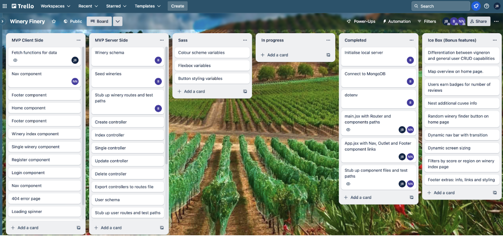
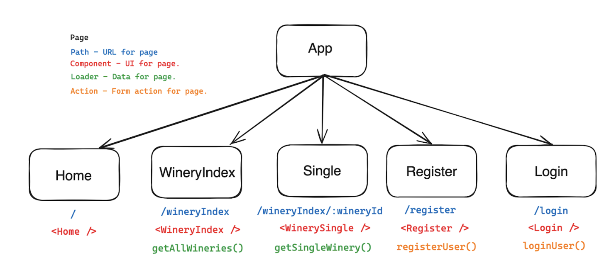
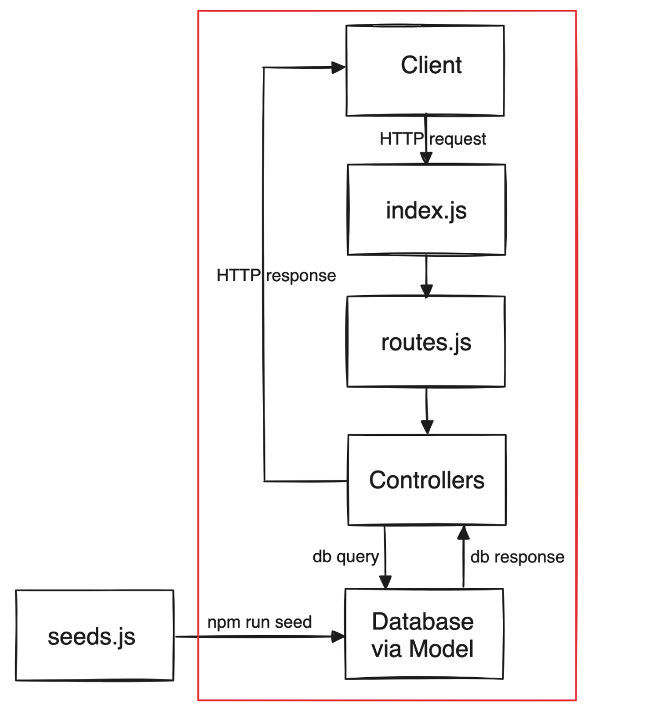

# General Assembly Project 3 - Vinous Voyages

## Overview

This application facilitates user exploration of diverse wineries, offering seamless navigation and functionalities for the addition, deletion, or modification of winery details. Additionally, it provides geographical information to determine the precise global locations of each winery.

## Technology Used

- JavaScript
- HTML
- CSS
- Node.js
- MongoDB
- Express
- Axios
- Bootstrap
- React
- SASS
- Trello
- GitHub
- Insomnia

## Visit Our Website
[Vinous-Voyages](https://www.vinousvoyages.com)

## Brief

The project encompassed a comprehensive one-week full stack group assignment, where myself, Benedict, and James worked together. Our primary objective was to develop a functional application utilising a public API, necessitating the creation of both a backend server and frontend interface.

## Technical Requirements

- Full-stack application with custom backend and frontend
- Express API serving data from a Mongo database
- Separate frontend built with React consuming the API
- Complete product with CRUD functionality for multiple models
- Thoughtful user stories/wireframes to prioritise core MVP features
- Visually impressive design for portfolio enhancement
- Deployment of the app online for public access

## Necessary Deliverables

- Working app hosted online with URL in GitHub repo
- GitHub repository with frequent commits dating back to project start
- Readme.md file containing:
  - Embedded app screenshot
  - Explanation of used technologies
  - Brief overview of the approach taken
  - Installation instructions for dependencies
  - Links to user stories/wireframes and pitch deck/presentation
  - Descriptions of any unsolved problems or major hurdles overcome.

## Planning

During the initial day, our group engaged in an extensive brainstorming session to generate various concepts, ultimately culminating in the decision to develop a website centred around wineries. Subsequently, we proceeded to create wireframes to represent the website structure, employing Trello to allocate tasks among team members. This strategic approach aimed at achieving our Minimum Viable Product (MVP) within a specific timeframe, following which, we outlined additional features for implementation. Notably, we dedicated an entire day to strict planning, recognising its pivotal role in our project's success.

### Wireframes 

## Approach Taken

- **Day 1:** We gathered for an intensive planning session, collectively generating and harmonising ideas before dedicating an entire day to meticulous planning.
- **Day 2:** After finalising our decisions, I allocated tasks to each group member. My responsibility was the frontend, focusing on organising folder structures and ensuring smooth navigation between pages.
- **Day 3:** During our daily stand-up, we reviewed progress from the previous day and outlined tasks for the current one. I concentrated on integrating backend data onto each page while James worked on functionalities.
- **Day 4:** Another stand-up session allowed us to discuss previous achievements and assign new tasks based on our Trello board. I took the initiative to enhance the navigation bar's design and implement additional functionalities.
- **Day 5:** With the user's login essential for many application functionalities, I focused on developing the sign-in and sign-up pages. The team relied on me to ensure smooth user authentication.
- **Day 6:** During our stand-up, we addressed any issues and provided assistance where needed. I began working on CSS to enhance the visual appeal of the pages.
- **Day 7:** As a group, we reviewed our work, identifying what worked well and what needed improvement before our final presentation. We also worked on bonus features to further enhance our project.

## Project Wins and Key Learnings

- Successful development of a fully functional full-stack application.
- Effective collaboration within the team facilitated by strong communication and daily stand-up meetings.
- Enhanced time management skills and resilience in overcoming minor setbacks encountered during development.

## Challenges

- Resolving minor bugs encountered during the development process.
- Ensuring smooth merging of individual work into the main development branch.

## Future Improvements

- Completion of all bonuses on time.
- Improved communication among team members.
- Focus on refining the little details.

